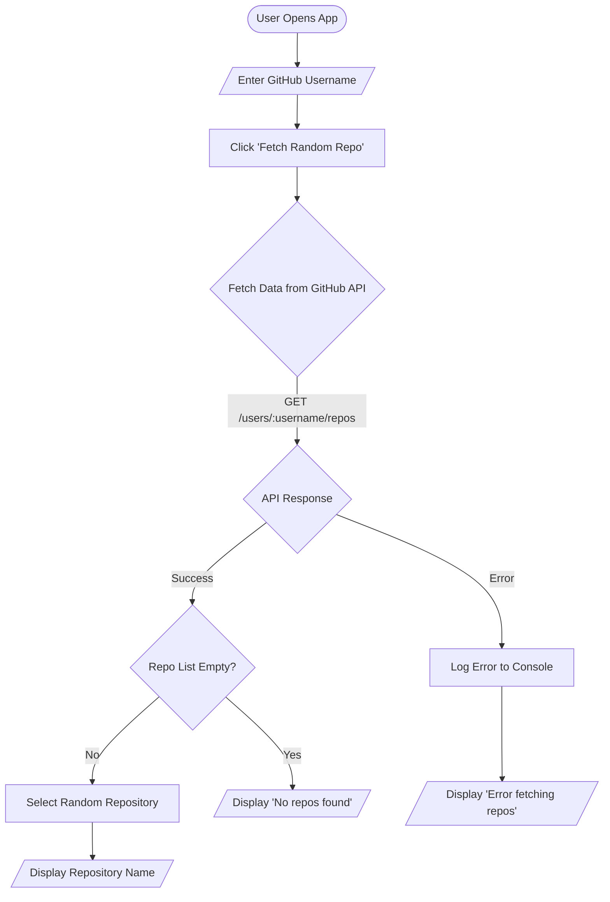

# GitHub Random Repo Fetch

A React Native mobile application built with [Expo](https://expo.dev) that allows users to discover random repositories from any GitHub user's public profile.

## 🚀 Overview

This application provides a simple and intuitive interface for users to explore GitHub repositories. By entering a valid GitHub username, the app fetches the user's public repository list and randomly selects one to display. It's a fun tool for discovering new projects or just testing the GitHub API integration.

## ✨ Features

- **User Input:** customizable text field to enter any GitHub username.
- **API Integration:** Seamlessly fetches data from the GitHub REST API.
- **Randomizer:** Logic to randomly select one repository from the fetched list.
- **Error Handling:** Gracefully handles invalid usernames, network errors, or users with no repositories.
- **Cross-Platform:** Runs on Android, iOS, and Web (powered by Expo).

## 📊 Application Flow

The following diagram illustrates how the application processes user input and interacts with the GitHub API:



## 🛠️ Tech Stack

- **Framework:** [React Native](https://reactnative.dev/)
- **Platform:** [Expo](https://expo.dev/) (Managed Workflow)
- **Routing:** [Expo Router](https://docs.expo.dev/router/introduction)
- **Language:** TypeScript
- **Styling:** React Native StyleSheet

## 🏃‍♂️ Get Started

### Prerequisites

- Node.js installed on your machine.
- A package manager like `npm` or `yarn`.

### Installation

1. **Clone the repository:**
   ```bash
   git clone <repository-url>
   cd github_random_repo_fetch
   ```

2. **Install dependencies:**
   ```bash
   npm install
   ```

3. **Start the app:**
   ```bash
   npx expo start
   ```

### Running the App

After running the start command, you can view the app on:
- **Mobile:** Scan the QR code with the Expo Go app (Android) or Camera app (iOS).
- **Web:** Press `w` in the terminal to open in the browser.
- **Emulators:** Press `a` for Android or `i` for iOS (requires setup).